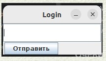
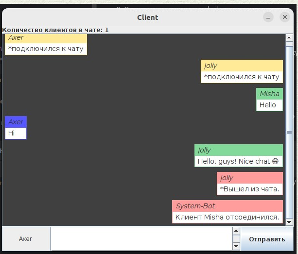

## Сетевой чат ッ ##

### Что используем: ### 
- Java
- Swing
- Modules
- Maven
- Sockets

### Из интересного: ###
1. Мы намеренно не будем общаться через readLine() или readObject().
 
2. Мы будем сообщение читать посимвольно. И сами определим, когда наступит конец сообщения (с помощью спец.символа).
 
3. Все сообщения мы преобразовываем JSON. Да - так будет удобно. Не факт, что клиентская часть будет на java. (В дальнейшем, мы сделаем клиент на React).
 
4. Пингуем кликнтов, чтобы не обслуживать "неживые" соединения.

### Запуск проекта: ###
1. Т.к. используем maven, то выполняем mvn package. И вот у нас уже готовые jar в каталогах target каждого модуля.
  
Интересуют нас только 2 модуля: client и server.
2. Сервер разворачиваем в docker, выполнив команду "docker-compose up -d".
3. Клиентов запускаем через jar (./client/target/client-1.0-SNAPSHOT.jar).
 
Если используете IDEA, не забудьте поставить галочку Allow multiple instances.

### Очевидные минусы: ###
- Код не покрыт тестами.
- Так себе внешний вид. Сильно не ругаемся, т.к. автор врепвые увидел Swing.

### Внешний вид: ###

  
